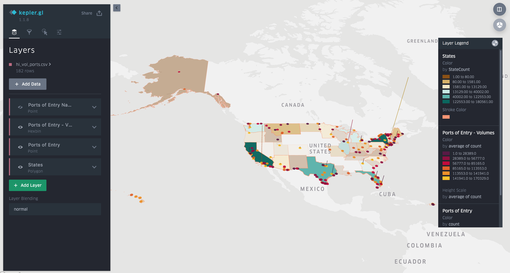

# US Data Immigration Analysis - Shawarma Joint
### Data Engineering Capstone Project

#### Project Summary
--describe your project at a high level--

The project follows the follow steps:
* Step 1: Scope the Project and Gather Data
* Step 2: Explore and Assess the Data
* Step 3: Define the Data Model
* Step 4: Run ETL to Model the Data
* Step 5: Complete Project Write Up

### Step 1: Scope the Project and Gather Data

#### Scope 
Explain what you plan to do in the project in more detail. What data do you use? What is your end solution look like? What tools did you use? etc>

#### Describe and Gather Data 
Describe the data sets you're using. Where did it come from? What type of information is included? 

### Business Case Research - Shawarma Joint

Avengers eating Shawarma: 
https://www.youtube.com/watch?v=EYiZeszLosE

Shawarma is the most popular Arabic street food / fast food. Therefore, the target is to conduct a study to open up a shawarma place in one of the airports that see the highest number of trips of visitors and students from Arabic countries.


### Data Sources
* List of Arabic Countries
* Population Data from the WorldBank
* List of US Cities and their Lat/Lng coordinates
* Airport Codes


Note: I have imported lots of 3rd party data files, just to join them with the data for exploration purposes. I won't be using all these data sources though.

 


```python
!pip install python-Levenshtein fuzzywuzzy pyshp geopandas
```

    Collecting python-Levenshtein
    [?25l  Downloading https://files.pythonhosted.org/packages/42/a9/d1785c85ebf9b7dfacd08938dd028209c34a0ea3b1bcdb895208bd40a67d/python-Levenshtein-0.12.0.tar.gz (48kB)
        100% |████████████████████████████████| 51kB 2.5MB/s ta 0:00:011
    [?25hRequirement already satisfied: fuzzywuzzy in /opt/conda/lib/python3.6/site-packages (0.17.0)
    Requirement already satisfied: pyshp in /opt/conda/lib/python3.6/site-packages (2.1.0)
    Requirement already satisfied: geopandas in /opt/conda/lib/python3.6/site-packages (0.6.0)
    Requirement already satisfied: setuptools in /opt/conda/lib/python3.6/site-packages (from python-Levenshtein) (38.4.0)
    Requirement already satisfied: pyproj in /opt/conda/lib/python3.6/site-packages (from geopandas) (2.4.0)
    Requirement already satisfied: shapely in /opt/conda/lib/python3.6/site-packages (from geopandas) (1.6.4.post1)
    Requirement already satisfied: fiona in /opt/conda/lib/python3.6/site-packages (from geopandas) (1.8.8)
    Requirement already satisfied: pandas>=0.23.0 in /opt/conda/lib/python3.6/site-packages (from geopandas) (0.23.3)
    Requirement already satisfied: click<8,>=4.0 in /opt/conda/lib/python3.6/site-packages (from fiona->geopandas) (6.7)
    Requirement already satisfied: cligj>=0.5 in /opt/conda/lib/python3.6/site-packages (from fiona->geopandas) (0.5.0)
    Requirement already satisfied: munch in /opt/conda/lib/python3.6/site-packages (from fiona->geopandas) (2.3.2)
    Requirement already satisfied: attrs>=17 in /opt/conda/lib/python3.6/site-packages (from fiona->geopandas) (19.1.0)
    Requirement already satisfied: click-plugins>=1.0 in /opt/conda/lib/python3.6/site-packages (from fiona->geopandas) (1.1.1)
    Requirement already satisfied: six>=1.7 in /opt/conda/lib/python3.6/site-packages (from fiona->geopandas) (1.11.0)
    Requirement already satisfied: python-dateutil>=2.5.0 in /opt/conda/lib/python3.6/site-packages (from pandas>=0.23.0->geopandas) (2.6.1)
    Requirement already satisfied: pytz>=2011k in /opt/conda/lib/python3.6/site-packages (from pandas>=0.23.0->geopandas) (2017.3)
    Requirement already satisfied: numpy>=1.9.0 in /opt/conda/lib/python3.6/site-packages (from pandas>=0.23.0->geopandas) (1.12.1)
    Building wheels for collected packages: python-Levenshtein
      Running setup.py bdist_wheel for python-Levenshtein ... [?25ldone
    [?25h  Stored in directory: /root/.cache/pip/wheels/de/c2/93/660fd5f7559049268ad2dc6d81c4e39e9e36518766eaf7e342
    Successfully built python-Levenshtein
    Installing collected packages: python-Levenshtein
    Successfully installed python-Levenshtein-0.12.0


## Importing Libraries and Creating Spark Session


```python
# Do all imports and installs here
import pandas as pd
import fuzzywuzzy
import shapefile
from shapely.geometry.polygon import LinearRing, Polygon, LineString

pd.set_option('display.max_rows', 500)
pd.set_option('display.max_columns', 500)
pd.set_option('display.width', 1000)

import  pyspark.sql.functions as F
from pyspark.sql.types import StructType as R, StructField as Fld, DoubleType as Dbl, StringType as Str
from pyspark.sql.types import IntegerType as Int, DateType as Date
```


```python
	
from pyspark.sql import SparkSession
spark = SparkSession.builder.\
config("spark.jars.packages","saurfang:spark-sas7bdat:2.0.0-s_2.11")\
.enableHiveSupport().getOrCreate()

#df_spark =spark.read.format('com.github.saurfang.sas.spark').load('../../data/18-83510-I94-Data-2016/i94_aug16_sub.sas7bdat')
sc = spark.sparkContext
spark.sparkContext.setLogLevel('ERROR')
spark.conf.set("spark.sql.shuffle.partitions", 20)
```

### Step 2: Explore and Assess the Data
#### Explore the Data 
Identify data quality issues, like missing values, duplicate data, etc.

#### Cleaning Steps
Document steps necessary to clean the data

### Reading and Exploring Temperature Data


```python
fname = '../../data2/GlobalLandTemperaturesByCity.csv'
temp_df = pd.read_csv(fname)
```


```python
round(temp_df[(temp_df['Country'] == 'United States') & (temp_df['City'] == 'Boston')].iloc[-12:]['AverageTemperature'].mean(), 1)
```


    8.9000000000000004


### Reading and Exploring Population Data
#### Downloaded from https://data.worldbank.org/indicator/SP.POP.TOTL?end=2018&start=2013


```python
# pop_sizes_df = pd.read_csv('WorldBankPopulationSizeByCountry.csv')
pop_sizes_df = pop_sizes_df.rename({'Country Name':'CountryName'}, axis=1)
country_names = list(pop_sizes_df['CountryName'])
pop_sizes_df = pop_sizes_df.set_index('CountryName')
pop_sizes_df.head()

from fuzzywuzzy import process 
from fuzzywuzzy import fuzz

def findClosestCountryName(cn, cns= country_names, setOrSort=True, population=False):
    max_score = 0
    country = ''
    
    for n in cns:
        if setOrSort == True:
            score = fuzz.token_set_ratio(cn, n)
        else:
            score = fuzz.token_sort_ratio(cn, n)
        if score > max_score: 
            max_score = score
            country = n
            
    if population == True:
        return pd.Series([country, max_score, pop_sizes_df.loc[country]['2016']])
    return pd.Series([country, max_score])

print(findClosestCountryName('MEXICO Air Sea, and Not Reported (I-94, no land arrivals)', country_names)[0])
print(findClosestCountryName('CHINA, PRC', country_names)[0])
```


```python
pop_sizes_df.head(3)
```


<div>

<style scoped>

    .dataframe tbody tr th:only-of-type {
        vertical-align: middle;
    }

    .dataframe tbody tr th {
        vertical-align: top;
    }

    .dataframe thead th {
        text-align: right;
    }

</style>

<table border="1" class="dataframe">
  <thead>
    <tr style="text-align: right;">
      <th></th>
      <th>Country Code</th>
      <th>Indicator Name</th>
      <th>Indicator Code</th>
      <th>1960</th>
      <th>1961</th>
      <th>1962</th>
      <th>1963</th>
      <th>1964</th>
      <th>1965</th>
      <th>1966</th>
      <th>1967</th>
      <th>1968</th>
      <th>1969</th>
      <th>1970</th>
      <th>1971</th>
      <th>1972</th>
      <th>1973</th>
      <th>1974</th>
      <th>1975</th>
      <th>1976</th>
      <th>1977</th>
      <th>1978</th>
      <th>1979</th>
      <th>1980</th>
      <th>1981</th>
      <th>1982</th>
      <th>1983</th>
      <th>1984</th>
      <th>1985</th>
      <th>1986</th>
      <th>1987</th>
      <th>1988</th>
      <th>1989</th>
      <th>1990</th>
      <th>1991</th>
      <th>1992</th>
      <th>1993</th>
      <th>1994</th>
      <th>1995</th>
      <th>1996</th>
      <th>1997</th>
      <th>1998</th>
      <th>1999</th>
      <th>2000</th>
      <th>2001</th>
      <th>2002</th>
      <th>2003</th>
      <th>2004</th>
      <th>2005</th>
      <th>2006</th>
      <th>2007</th>
      <th>2008</th>
      <th>2009</th>
      <th>2010</th>
      <th>2011</th>
      <th>2012</th>
      <th>2013</th>
      <th>2014</th>
      <th>2015</th>
      <th>2016</th>
      <th>2017</th>
      <th>2018</th>
    </tr>
    <tr>
      <th>CountryName</th>
      <th></th>
      <th></th>
      <th></th>
      <th></th>
      <th></th>
      <th></th>
      <th></th>
      <th></th>
      <th></th>
      <th></th>
      <th></th>
      <th></th>
      <th></th>
      <th></th>
      <th></th>
      <th></th>
      <th></th>
      <th></th>
      <th></th>
      <th></th>
      <th></th>
      <th></th>
      <th></th>
      <th></th>
      <th></th>
      <th></th>
      <th></th>
      <th></th>
      <th></th>
      <th></th>
      <th></th>
      <th></th>
      <th></th>
      <th></th>
      <th></th>
      <th></th>
      <th></th>
      <th></th>
      <th></th>
      <th></th>
      <th></th>
      <th></th>
      <th></th>
      <th></th>
      <th></th>
      <th></th>
      <th></th>
      <th></th>
      <th></th>
      <th></th>
      <th></th>
      <th></th>
      <th></th>
      <th></th>
      <th></th>
      <th></th>
      <th></th>
      <th></th>
      <th></th>
      <th></th>
      <th></th>
      <th></th>
    </tr>
  </thead>
  <tbody>
    <tr>
      <th>Aruba</th>
      <td>ABW</td>
      <td>Population, total</td>
      <td>SP.POP.TOTL</td>
      <td>54211.0</td>
      <td>55438.0</td>
      <td>56225.0</td>
      <td>56695.0</td>
      <td>57032.0</td>
      <td>57360.0</td>
      <td>57715.0</td>
      <td>58055.0</td>
      <td>58386.0</td>
      <td>58726.0</td>
      <td>59063.0</td>
      <td>59440.0</td>
      <td>59840.0</td>
      <td>60243.0</td>
      <td>60528.0</td>
      <td>60657.0</td>
      <td>60586.0</td>
      <td>60366.0</td>
      <td>60103.0</td>
      <td>59980.0</td>
      <td>60096.0</td>
      <td>60567.0</td>
      <td>61345.0</td>
      <td>62201.0</td>
      <td>62836.0</td>
      <td>63026.0</td>
      <td>62644.0</td>
      <td>61833.0</td>
      <td>61079.0</td>
      <td>61032.0</td>
      <td>62149.0</td>
      <td>64622.0</td>
      <td>68235.0</td>
      <td>72504.0</td>
      <td>76700.0</td>
      <td>80324.0</td>
      <td>83200.0</td>
      <td>85451.0</td>
      <td>87277.0</td>
      <td>89005.0</td>
      <td>90853.0</td>
      <td>92898.0</td>
      <td>94992.0</td>
      <td>97017.0</td>
      <td>98737.0</td>
      <td>100031.0</td>
      <td>100834.0</td>
      <td>101222.0</td>
      <td>101358.0</td>
      <td>101455.0</td>
      <td>101669.0</td>
      <td>102046.0</td>
      <td>102560.0</td>
      <td>103159.0</td>
      <td>103774.0</td>
      <td>104341.0</td>
      <td>104872.0</td>
      <td>105366.0</td>
      <td>105845.0</td>
    </tr>
    <tr>
      <th>Afghanistan</th>
      <td>AFG</td>
      <td>Population, total</td>
      <td>SP.POP.TOTL</td>
      <td>8996973.0</td>
      <td>9169410.0</td>
      <td>9351441.0</td>
      <td>9543205.0</td>
      <td>9744781.0</td>
      <td>9956320.0</td>
      <td>10174836.0</td>
      <td>10399926.0</td>
      <td>10637063.0</td>
      <td>10893776.0</td>
      <td>11173642.0</td>
      <td>11475445.0</td>
      <td>11791215.0</td>
      <td>12108963.0</td>
      <td>12412950.0</td>
      <td>12689160.0</td>
      <td>12943093.0</td>
      <td>13171306.0</td>
      <td>13341198.0</td>
      <td>13411056.0</td>
      <td>13356511.0</td>
      <td>13171673.0</td>
      <td>12882528.0</td>
      <td>12537730.0</td>
      <td>12204292.0</td>
      <td>11938208.0</td>
      <td>11736179.0</td>
      <td>11604534.0</td>
      <td>11618005.0</td>
      <td>11868877.0</td>
      <td>12412308.0</td>
      <td>13299017.0</td>
      <td>14485546.0</td>
      <td>15816603.0</td>
      <td>17075727.0</td>
      <td>18110657.0</td>
      <td>18853437.0</td>
      <td>19357126.0</td>
      <td>19737765.0</td>
      <td>20170844.0</td>
      <td>20779953.0</td>
      <td>21606988.0</td>
      <td>22600770.0</td>
      <td>23680871.0</td>
      <td>24726684.0</td>
      <td>25654277.0</td>
      <td>26433049.0</td>
      <td>27100536.0</td>
      <td>27722276.0</td>
      <td>28394813.0</td>
      <td>29185507.0</td>
      <td>30117413.0</td>
      <td>31161376.0</td>
      <td>32269589.0</td>
      <td>33370794.0</td>
      <td>34413603.0</td>
      <td>35383128.0</td>
      <td>36296400.0</td>
      <td>37172386.0</td>
    </tr>
    <tr>
      <th>Angola</th>
      <td>AGO</td>
      <td>Population, total</td>
      <td>SP.POP.TOTL</td>
      <td>5454933.0</td>
      <td>5531472.0</td>
      <td>5608539.0</td>
      <td>5679458.0</td>
      <td>5735044.0</td>
      <td>5770570.0</td>
      <td>5781214.0</td>
      <td>5774243.0</td>
      <td>5771652.0</td>
      <td>5803254.0</td>
      <td>5890365.0</td>
      <td>6040777.0</td>
      <td>6248552.0</td>
      <td>6496962.0</td>
      <td>6761380.0</td>
      <td>7024000.0</td>
      <td>7279509.0</td>
      <td>7533735.0</td>
      <td>7790707.0</td>
      <td>8058067.0</td>
      <td>8341289.0</td>
      <td>8640446.0</td>
      <td>8952950.0</td>
      <td>9278096.0</td>
      <td>9614754.0</td>
      <td>9961997.0</td>
      <td>10320111.0</td>
      <td>10689250.0</td>
      <td>11068050.0</td>
      <td>11454777.0</td>
      <td>11848386.0</td>
      <td>12248901.0</td>
      <td>12657366.0</td>
      <td>13075049.0</td>
      <td>13503747.0</td>
      <td>13945206.0</td>
      <td>14400719.0</td>
      <td>14871570.0</td>
      <td>15359601.0</td>
      <td>15866869.0</td>
      <td>16395473.0</td>
      <td>16945753.0</td>
      <td>17519417.0</td>
      <td>18121479.0</td>
      <td>18758145.0</td>
      <td>19433602.0</td>
      <td>20149901.0</td>
      <td>20905363.0</td>
      <td>21695634.0</td>
      <td>22514281.0</td>
      <td>23356246.0</td>
      <td>24220661.0</td>
      <td>25107931.0</td>
      <td>26015780.0</td>
      <td>26941779.0</td>
      <td>27884381.0</td>
      <td>28842484.0</td>
      <td>29816748.0</td>
      <td>30809762.0</td>
    </tr>
  </tbody>
</table>
</div>


### Reading in US Cities Location Data

### Reading and Exploring Airport Code Data


```python
airport_codes = pd.read_csv('airport-codes_csv.csv')
airport_codes = airport_codes.fillna('')
airport_codes = airport_codes[(airport_codes['iso_country'] == 'US') & (airport_codes['type'] == 'large_airport')]
airport_codes['municipality'] = airport_codes['municipality'].apply(lambda x: x.lower())
airport_codes[airport_codes['municipality'] == 'orlando'].head()
```


<div>

<style scoped>
    .dataframe tbody tr th:only-of-type {
        vertical-align: middle;
    }

    .dataframe tbody tr th {
        vertical-align: top;
    }

    .dataframe thead th {
        text-align: right;
    }
</style>
<table border="1" class="dataframe">
  <thead>
    <tr style="text-align: right;">
      <th></th>
      <th>ident</th>
      <th>type</th>
      <th>name</th>
      <th>elevation_ft</th>
      <th>continent</th>
      <th>iso_country</th>
      <th>iso_region</th>
      <th>municipality</th>
      <th>gps_code</th>
      <th>iata_code</th>
      <th>local_code</th>
      <th>coordinates</th>
    </tr>
  </thead>
  <tbody>
    <tr>
      <th>28001</th>
      <td>KMCO</td>
      <td>large_airport</td>
      <td>Orlando International Airport</td>
      <td>96</td>
      <td></td>
      <td>US</td>
      <td>US-FL</td>
      <td>orlando</td>
      <td>KMCO</td>
      <td>MCO</td>
      <td>MCO</td>
      <td>-81.30899810791016, 28.429399490356445</td>
    </tr>
    <tr>
      <th>29937</th>
      <td>KSFB</td>
      <td>large_airport</td>
      <td>Orlando Sanford International Airport</td>
      <td>55</td>
      <td></td>
      <td>US</td>
      <td>US-FL</td>
      <td>orlando</td>
      <td>KSFB</td>
      <td>SFB</td>
      <td>SFB</td>
      <td>-81.23750305175781, 28.777599334716797</td>
    </tr>
  </tbody>
</table>
</div>


```python
len(airport_codes)
```


    862


### Reading and Exploring Demographics Data
Reference: https://simplemaps.com/data/us-cities


```python
us_cities = pd.read_csv('uscities.csv')
us_cities.head()
```


<div>

<style scoped>
    .dataframe tbody tr th:only-of-type {
        vertical-align: middle;
    }

    .dataframe tbody tr th {
        vertical-align: top;
    }

    .dataframe thead th {
        text-align: right;
    }
</style>
<table border="1" class="dataframe">
  <thead>
    <tr style="text-align: right;">
      <th></th>
      <th>city</th>
      <th>city_ascii</th>
      <th>state_id</th>
      <th>state_name</th>
      <th>county_fips</th>
      <th>county_name</th>
      <th>county_fips_all</th>
      <th>county_name_all</th>
      <th>lat</th>
      <th>lng</th>
      <th>population</th>
      <th>density</th>
      <th>source</th>
      <th>military</th>
      <th>incorporated</th>
      <th>timezone</th>
      <th>ranking</th>
      <th>zips</th>
      <th>id</th>
    </tr>
  </thead>
  <tbody>
    <tr>
      <th>0</th>
      <td>South Creek</td>
      <td>South Creek</td>
      <td>WA</td>
      <td>Washington</td>
      <td>53053</td>
      <td>Pierce</td>
      <td>53053</td>
      <td>Pierce</td>
      <td>46.9994</td>
      <td>-122.3921</td>
      <td>2500.0</td>
      <td>125.0</td>
      <td>polygon</td>
      <td>False</td>
      <td>True</td>
      <td>America/Los_Angeles</td>
      <td>3</td>
      <td>98580 98387 98338</td>
      <td>1840116412</td>
    </tr>
    <tr>
      <th>1</th>
      <td>Roslyn</td>
      <td>Roslyn</td>
      <td>WA</td>
      <td>Washington</td>
      <td>53037</td>
      <td>Kittitas</td>
      <td>53037</td>
      <td>Kittitas</td>
      <td>47.2507</td>
      <td>-121.0989</td>
      <td>947.0</td>
      <td>84.0</td>
      <td>polygon</td>
      <td>False</td>
      <td>True</td>
      <td>America/Los_Angeles</td>
      <td>3</td>
      <td>98941 98068 98925</td>
      <td>1840097718</td>
    </tr>
    <tr>
      <th>2</th>
      <td>Sprague</td>
      <td>Sprague</td>
      <td>WA</td>
      <td>Washington</td>
      <td>53043</td>
      <td>Lincoln</td>
      <td>53043</td>
      <td>Lincoln</td>
      <td>47.3048</td>
      <td>-117.9713</td>
      <td>441.0</td>
      <td>163.0</td>
      <td>polygon</td>
      <td>False</td>
      <td>True</td>
      <td>America/Los_Angeles</td>
      <td>3</td>
      <td>99032</td>
      <td>1840096300</td>
    </tr>
    <tr>
      <th>3</th>
      <td>Gig Harbor</td>
      <td>Gig Harbor</td>
      <td>WA</td>
      <td>Washington</td>
      <td>53053</td>
      <td>Pierce</td>
      <td>53053</td>
      <td>Pierce</td>
      <td>47.3352</td>
      <td>-122.5968</td>
      <td>9507.0</td>
      <td>622.0</td>
      <td>polygon</td>
      <td>False</td>
      <td>True</td>
      <td>America/Los_Angeles</td>
      <td>3</td>
      <td>98332 98335</td>
      <td>1840097082</td>
    </tr>
    <tr>
      <th>4</th>
      <td>Lake Cassidy</td>
      <td>Lake Cassidy</td>
      <td>WA</td>
      <td>Washington</td>
      <td>53061</td>
      <td>Snohomish</td>
      <td>53061</td>
      <td>Snohomish</td>
      <td>48.0639</td>
      <td>-122.0920</td>
      <td>3591.0</td>
      <td>131.0</td>
      <td>polygon</td>
      <td>False</td>
      <td>True</td>
      <td>America/Los_Angeles</td>
      <td>3</td>
      <td>98223 98258 98270</td>
      <td>1840116371</td>
    </tr>
  </tbody>
</table>
</div>


```python
demog = pd.read_csv('us-cities-demographics.csv', delimiter=';')
demog.head()
```


<div>

<style scoped>
    .dataframe tbody tr th:only-of-type {
        vertical-align: middle;
    }

    .dataframe tbody tr th {
        vertical-align: top;
    }

    .dataframe thead th {
        text-align: right;
    }
</style>
<table border="1" class="dataframe">
  <thead>
    <tr style="text-align: right;">
      <th></th>
      <th>City</th>
      <th>State</th>
      <th>Median Age</th>
      <th>Male Population</th>
      <th>Female Population</th>
      <th>Total Population</th>
      <th>Number of Veterans</th>
      <th>Foreign-born</th>
      <th>Average Household Size</th>
      <th>State Code</th>
      <th>Race</th>
      <th>Count</th>
    </tr>
  </thead>
  <tbody>
    <tr>
      <th>0</th>
      <td>Silver Spring</td>
      <td>Maryland</td>
      <td>33.8</td>
      <td>40601.0</td>
      <td>41862.0</td>
      <td>82463</td>
      <td>1562.0</td>
      <td>30908.0</td>
      <td>2.60</td>
      <td>MD</td>
      <td>Hispanic or Latino</td>
      <td>25924</td>
    </tr>
    <tr>
      <th>1</th>
      <td>Quincy</td>
      <td>Massachusetts</td>
      <td>41.0</td>
      <td>44129.0</td>
      <td>49500.0</td>
      <td>93629</td>
      <td>4147.0</td>
      <td>32935.0</td>
      <td>2.39</td>
      <td>MA</td>
      <td>White</td>
      <td>58723</td>
    </tr>
    <tr>
      <th>2</th>
      <td>Hoover</td>
      <td>Alabama</td>
      <td>38.5</td>
      <td>38040.0</td>
      <td>46799.0</td>
      <td>84839</td>
      <td>4819.0</td>
      <td>8229.0</td>
      <td>2.58</td>
      <td>AL</td>
      <td>Asian</td>
      <td>4759</td>
    </tr>
    <tr>
      <th>3</th>
      <td>Rancho Cucamonga</td>
      <td>California</td>
      <td>34.5</td>
      <td>88127.0</td>
      <td>87105.0</td>
      <td>175232</td>
      <td>5821.0</td>
      <td>33878.0</td>
      <td>3.18</td>
      <td>CA</td>
      <td>Black or African-American</td>
      <td>24437</td>
    </tr>
    <tr>
      <th>4</th>
      <td>Newark</td>
      <td>New Jersey</td>
      <td>34.6</td>
      <td>138040.0</td>
      <td>143873.0</td>
      <td>281913</td>
      <td>5829.0</td>
      <td>86253.0</td>
      <td>2.73</td>
      <td>NJ</td>
      <td>White</td>
      <td>76402</td>
    </tr>
  </tbody>
</table>
</div>


#### Determining the biggest minority in each state - not sure where this might be useful


```python
demog_race=demog.groupby(['State Code', 'Race']).agg({'Count':'sum', 'Median Age':'mean'})\
        .sort_values('Count', ascending=False)
demog_race = demog_race.reset_index()
demog_race = demog_race[demog_race['Race'] != 'White'].groupby(['State Code','Race']).agg({'Count':'max'})\
    .sort_values(['State Code', 'Count'], ascending=[True, False]).reset_index().set_index('State Code')

cols = ['State Code', 'Minority', 'Count']
biggest_minority = pd.DataFrame(columns = cols)

for i in list(set(demog_race.index)):
    biggest_minority = biggest_minority.append(pd.Series([i] + list(demog_race.loc[i].iloc[0].values), 
                                                         index=cols), ignore_index=True)
biggest_minority = biggest_minority.set_index('State Code')
biggest_minority.sort_values('Count', ascending=False).head()
```


<div>

<style scoped>
    .dataframe tbody tr th:only-of-type {
        vertical-align: middle;
    }

    .dataframe tbody tr th {
        vertical-align: top;
    }

    .dataframe thead th {
        text-align: right;
    }
</style>
<table border="1" class="dataframe">
  <thead>
    <tr style="text-align: right;">
      <th></th>
      <th>Minority</th>
      <th>Count</th>
    </tr>
    <tr>
      <th>State Code</th>
      <th></th>
      <th></th>
    </tr>
  </thead>
  <tbody>
    <tr>
      <th>CA</th>
      <td>Hispanic or Latino</td>
      <td>9856464</td>
    </tr>
    <tr>
      <th>TX</th>
      <td>Hispanic or Latino</td>
      <td>6311431</td>
    </tr>
    <tr>
      <th>NY</th>
      <td>Hispanic or Latino</td>
      <td>2730185</td>
    </tr>
    <tr>
      <th>FL</th>
      <td>Hispanic or Latino</td>
      <td>1942022</td>
    </tr>
    <tr>
      <th>AZ</th>
      <td>Hispanic or Latino</td>
      <td>1508157</td>
    </tr>
  </tbody>
</table>
</div>


### Reading in Immigration Data


```python
# Read in the data here
import os
data_dir = "../../data/18-83510-I94-Data-2016/"
files = os.listdir(data_dir)
for i in range(len(files)):
    files[i] = data_dir + files[i] 
files

dfs = []

for i in range(len(files)):
    dfs.append(spark.read.format('com.github.saurfang.sas.spark').load(files[i]))

```

#### Noticing that one of the months has 6 extra columns


```python
dfs[4].limit(5).toPandas().columns
```


    Index(['cicid', 'i94yr', 'i94mon', 'i94cit', 'i94res', 'i94port', 'arrdate', 'i94mode', 'i94addr', 'depdate', 'i94bir', 'i94visa', 'count', 'validres', 'delete_days', 'delete_mexl', 'delete_dup', 'delete_visa', 'delete_recdup', 'dtadfile', 'visapost', 'occup', 'entdepa', 'entdepd', 'entdepu', 'matflag', 'biryear', 'dtaddto', 'gender', 'insnum', 'airline', 'admnum', 'fltno', 'visatype'], dtype='object')


```python
dfs[0].limit(5).toPandas().columns
```


    Index(['cicid', 'i94yr', 'i94mon', 'i94cit', 'i94res', 'i94port', 'arrdate',
           'i94mode', 'i94addr', 'depdate', 'i94bir', 'i94visa', 'count',
           'dtadfile', 'visapost', 'occup', 'entdepa', 'entdepd', 'entdepu',
           'matflag', 'biryear', 'dtaddto', 'gender', 'insnum', 'airline',
           'admnum', 'fltno', 'visatype'],
          dtype='object')


```python
cols = ['delete_days', 'delete_mexl', 'delete_dup', 'delete_visa', 'delete_recdup']
```

#### Evaluating the information in those 6 extra columns


```python
display(dfs[4].limit(5).toPandas().head())
display(dfs[4].filter('validres != 1').limit(5).toPandas().head())

for c in cols:
    display(dfs[4].filter(c +' != 0').limit(5).toPandas().head())
```


<div>

<style scoped>
    .dataframe tbody tr th:only-of-type {
        vertical-align: middle;
    }

    .dataframe tbody tr th {
        vertical-align: top;
    }

    .dataframe thead th {
        text-align: right;
    }
</style>
<table border="1" class="dataframe">
  <thead>
    <tr style="text-align: right;">
      <th></th>
      <th>cicid</th>
      <th>i94yr</th>
      <th>i94mon</th>
      <th>i94cit</th>
      <th>i94res</th>
      <th>i94port</th>
      <th>arrdate</th>
      <th>i94mode</th>
      <th>i94addr</th>
      <th>depdate</th>
      <th>i94bir</th>
      <th>i94visa</th>
      <th>count</th>
      <th>validres</th>
      <th>delete_days</th>
      <th>delete_mexl</th>
      <th>delete_dup</th>
      <th>delete_visa</th>
      <th>delete_recdup</th>
      <th>dtadfile</th>
      <th>visapost</th>
      <th>occup</th>
      <th>entdepa</th>
      <th>entdepd</th>
      <th>entdepu</th>
      <th>matflag</th>
      <th>biryear</th>
      <th>dtaddto</th>
      <th>gender</th>
      <th>insnum</th>
      <th>airline</th>
      <th>admnum</th>
      <th>fltno</th>
      <th>visatype</th>
    </tr>
  </thead>
  <tbody>
    <tr>
      <th>0</th>
      <td>4.0</td>
      <td>2016.0</td>
      <td>6.0</td>
      <td>135.0</td>
      <td>135.0</td>
      <td>XXX</td>
      <td>20612.0</td>
      <td>None</td>
      <td>None</td>
      <td>None</td>
      <td>59.0</td>
      <td>2.0</td>
      <td>1.0</td>
      <td>1.0</td>
      <td>0.0</td>
      <td>0.0</td>
      <td>0.0</td>
      <td>0.0</td>
      <td>0.0</td>
      <td>None</td>
      <td>None</td>
      <td>None</td>
      <td>Z</td>
      <td>None</td>
      <td>U</td>
      <td>None</td>
      <td>1957.0</td>
      <td>10032016</td>
      <td>None</td>
      <td>None</td>
      <td>None</td>
      <td>1.493846e+10</td>
      <td>None</td>
      <td>WT</td>
    </tr>
    <tr>
      <th>1</th>
      <td>5.0</td>
      <td>2016.0</td>
      <td>6.0</td>
      <td>135.0</td>
      <td>135.0</td>
      <td>XXX</td>
      <td>20612.0</td>
      <td>None</td>
      <td>None</td>
      <td>None</td>
      <td>50.0</td>
      <td>2.0</td>
      <td>1.0</td>
      <td>1.0</td>
      <td>0.0</td>
      <td>0.0</td>
      <td>0.0</td>
      <td>0.0</td>
      <td>0.0</td>
      <td>None</td>
      <td>None</td>
      <td>None</td>
      <td>Z</td>
      <td>None</td>
      <td>U</td>
      <td>None</td>
      <td>1966.0</td>
      <td>10032016</td>
      <td>None</td>
      <td>None</td>
      <td>None</td>
      <td>1.746006e+10</td>
      <td>None</td>
      <td>WT</td>
    </tr>
    <tr>
      <th>2</th>
      <td>6.0</td>
      <td>2016.0</td>
      <td>6.0</td>
      <td>213.0</td>
      <td>213.0</td>
      <td>XXX</td>
      <td>20609.0</td>
      <td>None</td>
      <td>None</td>
      <td>None</td>
      <td>27.0</td>
      <td>3.0</td>
      <td>1.0</td>
      <td>1.0</td>
      <td>0.0</td>
      <td>0.0</td>
      <td>0.0</td>
      <td>0.0</td>
      <td>0.0</td>
      <td>None</td>
      <td>None</td>
      <td>None</td>
      <td>T</td>
      <td>None</td>
      <td>U</td>
      <td>None</td>
      <td>1989.0</td>
      <td>D/S</td>
      <td>None</td>
      <td>None</td>
      <td>None</td>
      <td>1.679298e+09</td>
      <td>None</td>
      <td>F1</td>
    </tr>
    <tr>
      <th>3</th>
      <td>7.0</td>
      <td>2016.0</td>
      <td>6.0</td>
      <td>213.0</td>
      <td>213.0</td>
      <td>XXX</td>
      <td>20611.0</td>
      <td>None</td>
      <td>None</td>
      <td>None</td>
      <td>23.0</td>
      <td>3.0</td>
      <td>1.0</td>
      <td>1.0</td>
      <td>0.0</td>
      <td>0.0</td>
      <td>0.0</td>
      <td>0.0</td>
      <td>0.0</td>
      <td>None</td>
      <td>None</td>
      <td>None</td>
      <td>T</td>
      <td>None</td>
      <td>U</td>
      <td>None</td>
      <td>1993.0</td>
      <td>D/S</td>
      <td>None</td>
      <td>None</td>
      <td>None</td>
      <td>1.140963e+09</td>
      <td>None</td>
      <td>F1</td>
    </tr>
    <tr>
      <th>4</th>
      <td>16.0</td>
      <td>2016.0</td>
      <td>6.0</td>
      <td>245.0</td>
      <td>245.0</td>
      <td>XXX</td>
      <td>20632.0</td>
      <td>None</td>
      <td>None</td>
      <td>None</td>
      <td>24.0</td>
      <td>3.0</td>
      <td>1.0</td>
      <td>1.0</td>
      <td>0.0</td>
      <td>0.0</td>
      <td>0.0</td>
      <td>0.0</td>
      <td>0.0</td>
      <td>None</td>
      <td>None</td>
      <td>None</td>
      <td>T</td>
      <td>None</td>
      <td>U</td>
      <td>None</td>
      <td>1992.0</td>
      <td>D/S</td>
      <td>None</td>
      <td>None</td>
      <td>None</td>
      <td>1.934535e+09</td>
      <td>None</td>
      <td>F1</td>
    </tr>
  </tbody>
</table>
</div>


<div>

<style scoped>
    .dataframe tbody tr th:only-of-type {
        vertical-align: middle;
    }

    .dataframe tbody tr th {
        vertical-align: top;
    }

    .dataframe thead th {
        text-align: right;
    }
</style>
<table border="1" class="dataframe">
  <thead>
    <tr style="text-align: right;">
      <th></th>
      <th>cicid</th>
      <th>i94yr</th>
      <th>i94mon</th>
      <th>i94cit</th>
      <th>i94res</th>
      <th>i94port</th>
      <th>arrdate</th>
      <th>i94mode</th>
      <th>i94addr</th>
      <th>depdate</th>
      <th>i94bir</th>
      <th>i94visa</th>
      <th>count</th>
      <th>validres</th>
      <th>delete_days</th>
      <th>delete_mexl</th>
      <th>delete_dup</th>
      <th>delete_visa</th>
      <th>delete_recdup</th>
      <th>dtadfile</th>
      <th>visapost</th>
      <th>occup</th>
      <th>entdepa</th>
      <th>entdepd</th>
      <th>entdepu</th>
      <th>matflag</th>
      <th>biryear</th>
      <th>dtaddto</th>
      <th>gender</th>
      <th>insnum</th>
      <th>airline</th>
      <th>admnum</th>
      <th>fltno</th>
      <th>visatype</th>
    </tr>
  </thead>
  <tbody>
  </tbody>
</table>
</div>


<div>

<style scoped>
    .dataframe tbody tr th:only-of-type {
        vertical-align: middle;
    }

    .dataframe tbody tr th {
        vertical-align: top;
    }

    .dataframe thead th {
        text-align: right;
    }
</style>
<table border="1" class="dataframe">
  <thead>
    <tr style="text-align: right;">
      <th></th>
      <th>cicid</th>
      <th>i94yr</th>
      <th>i94mon</th>
      <th>i94cit</th>
      <th>i94res</th>
      <th>i94port</th>
      <th>arrdate</th>
      <th>i94mode</th>
      <th>i94addr</th>
      <th>depdate</th>
      <th>i94bir</th>
      <th>i94visa</th>
      <th>count</th>
      <th>validres</th>
      <th>delete_days</th>
      <th>delete_mexl</th>
      <th>delete_dup</th>
      <th>delete_visa</th>
      <th>delete_recdup</th>
      <th>dtadfile</th>
      <th>visapost</th>
      <th>occup</th>
      <th>entdepa</th>
      <th>entdepd</th>
      <th>entdepu</th>
      <th>matflag</th>
      <th>biryear</th>
      <th>dtaddto</th>
      <th>gender</th>
      <th>insnum</th>
      <th>airline</th>
      <th>admnum</th>
      <th>fltno</th>
      <th>visatype</th>
    </tr>
  </thead>
  <tbody>
  </tbody>
</table>
</div>


<div>

<style scoped>
    .dataframe tbody tr th:only-of-type {
        vertical-align: middle;
    }

    .dataframe tbody tr th {
        vertical-align: top;
    }

    .dataframe thead th {
        text-align: right;
    }
</style>
<table border="1" class="dataframe">
  <thead>
    <tr style="text-align: right;">
      <th></th>
      <th>cicid</th>
      <th>i94yr</th>
      <th>i94mon</th>
      <th>i94cit</th>
      <th>i94res</th>
      <th>i94port</th>
      <th>arrdate</th>
      <th>i94mode</th>
      <th>i94addr</th>
      <th>depdate</th>
      <th>i94bir</th>
      <th>i94visa</th>
      <th>count</th>
      <th>validres</th>
      <th>delete_days</th>
      <th>delete_mexl</th>
      <th>delete_dup</th>
      <th>delete_visa</th>
      <th>delete_recdup</th>
      <th>dtadfile</th>
      <th>visapost</th>
      <th>occup</th>
      <th>entdepa</th>
      <th>entdepd</th>
      <th>entdepu</th>
      <th>matflag</th>
      <th>biryear</th>
      <th>dtaddto</th>
      <th>gender</th>
      <th>insnum</th>
      <th>airline</th>
      <th>admnum</th>
      <th>fltno</th>
      <th>visatype</th>
    </tr>
  </thead>
  <tbody>
  </tbody>
</table>
</div>


<div>

<style scoped>
    .dataframe tbody tr th:only-of-type {
        vertical-align: middle;
    }

    .dataframe tbody tr th {
        vertical-align: top;
    }

    .dataframe thead th {
        text-align: right;
    }
</style>
<table border="1" class="dataframe">
  <thead>
    <tr style="text-align: right;">
      <th></th>
      <th>cicid</th>
      <th>i94yr</th>
      <th>i94mon</th>
      <th>i94cit</th>
      <th>i94res</th>
      <th>i94port</th>
      <th>arrdate</th>
      <th>i94mode</th>
      <th>i94addr</th>
      <th>depdate</th>
      <th>i94bir</th>
      <th>i94visa</th>
      <th>count</th>
      <th>validres</th>
      <th>delete_days</th>
      <th>delete_mexl</th>
      <th>delete_dup</th>
      <th>delete_visa</th>
      <th>delete_recdup</th>
      <th>dtadfile</th>
      <th>visapost</th>
      <th>occup</th>
      <th>entdepa</th>
      <th>entdepd</th>
      <th>entdepu</th>
      <th>matflag</th>
      <th>biryear</th>
      <th>dtaddto</th>
      <th>gender</th>
      <th>insnum</th>
      <th>airline</th>
      <th>admnum</th>
      <th>fltno</th>
      <th>visatype</th>
    </tr>
  </thead>
  <tbody>
  </tbody>
</table>
</div>


<div>

<style scoped>
    .dataframe tbody tr th:only-of-type {
        vertical-align: middle;
    }

    .dataframe tbody tr th {
        vertical-align: top;
    }

    .dataframe thead th {
        text-align: right;
    }
</style>
<table border="1" class="dataframe">
  <thead>
    <tr style="text-align: right;">
      <th></th>
      <th>cicid</th>
      <th>i94yr</th>
      <th>i94mon</th>
      <th>i94cit</th>
      <th>i94res</th>
      <th>i94port</th>
      <th>arrdate</th>
      <th>i94mode</th>
      <th>i94addr</th>
      <th>depdate</th>
      <th>i94bir</th>
      <th>i94visa</th>
      <th>count</th>
      <th>validres</th>
      <th>delete_days</th>
      <th>delete_mexl</th>
      <th>delete_dup</th>
      <th>delete_visa</th>
      <th>delete_recdup</th>
      <th>dtadfile</th>
      <th>visapost</th>
      <th>occup</th>
      <th>entdepa</th>
      <th>entdepd</th>
      <th>entdepu</th>
      <th>matflag</th>
      <th>biryear</th>
      <th>dtaddto</th>
      <th>gender</th>
      <th>insnum</th>
      <th>airline</th>
      <th>admnum</th>
      <th>fltno</th>
      <th>visatype</th>
    </tr>
  </thead>
  <tbody>
  </tbody>
</table>
</div>


<div>

<style scoped>
    .dataframe tbody tr th:only-of-type {
        vertical-align: middle;
    }

    .dataframe tbody tr th {
        vertical-align: top;
    }

    .dataframe thead th {
        text-align: right;
    }
</style>
<table border="1" class="dataframe">
  <thead>
    <tr style="text-align: right;">
      <th></th>
      <th>cicid</th>
      <th>i94yr</th>
      <th>i94mon</th>
      <th>i94cit</th>
      <th>i94res</th>
      <th>i94port</th>
      <th>arrdate</th>
      <th>i94mode</th>
      <th>i94addr</th>
      <th>depdate</th>
      <th>i94bir</th>
      <th>i94visa</th>
      <th>count</th>
      <th>validres</th>
      <th>delete_days</th>
      <th>delete_mexl</th>
      <th>delete_dup</th>
      <th>delete_visa</th>
      <th>delete_recdup</th>
      <th>dtadfile</th>
      <th>visapost</th>
      <th>occup</th>
      <th>entdepa</th>
      <th>entdepd</th>
      <th>entdepu</th>
      <th>matflag</th>
      <th>biryear</th>
      <th>dtaddto</th>
      <th>gender</th>
      <th>insnum</th>
      <th>airline</th>
      <th>admnum</th>
      <th>fltno</th>
      <th>visatype</th>
    </tr>
  </thead>
  <tbody>
  </tbody>
</table>
</div>


#### Dropping extra columns - they don't contain any valuable information 


```python
dfs[4] = dfs[4].drop('validres')
for c in cols:
    dfs[4] = dfs[4].drop(c)
```

#### Joining all immigration data months


```python
imm_df = dfs[0]

for i in range(1, len(dfs)):
    imm_df = imm_df.union(dfs[i])
```


```python
imm_df.count()
```


    40790529


#### Writing to Parquet


```python
#write to parquet
imm_df.write.parquet("proc_sas_data")

```

### Spark Processing Checkpoint: Read all processed Immigration Data


```python
imm_df = spark.read.parquet("proc_sas_data")
```

### Exploring the Data through grouping by various dimensions


```python
top_ports = imm_df.groupby(['i94port']).count().orderBy(F.col('count'), ascending=False)
top_ports.coalesce(1).write.mode('overwrite').csv('ports.csv')
top_ports.show(5)
```

    +-------+-------+
    |i94port|  count|
    +-------+-------+
    |    NYC|6678555|
    |    MIA|5122889|
    |    LOS|4602847|
    |    SFR|2309621|
    |    HHW|2249967|
    +-------+-------+
    only showing top 5 rows
    


```python
top_res = imm_df.groupby(['i94res']).count().orderBy(F.col('count'), ascending=False)
top_res.coalesce(1).write.mode('overwrite').csv('res.csv')
top_res.show(5)
```

    +------+-------+
    |i94res|  count|
    +------+-------+
    | 135.0|4587092|
    | 209.0|3603786|
    | 245.0|3049942|
    | 582.0|2661125|
    | 112.0|2046288|
    +------+-------+
    only showing top 5 rows
    


```python
top_addr = imm_df.groupby(['i94addr']).count().orderBy(F.col('count'), ascending=False)
top_addr.coalesce(1).write.mode('overwrite').csv('addr.csv')
top_addr.show(5)
```

    +-------+-------+
    |i94addr|  count|
    +-------+-------+
    |     FL|8156192|
    |     NY|6764396|
    |     CA|6531491|
    |     HI|2338444|
    |   null|2027926|
    +-------+-------+
    only showing top 5 rows
    


```python
top_mode = imm_df.groupby(['i94mode']).count().orderBy(F.col('count'), ascending=False)
top_mode.coalesce(1).write.mode('overwrite').csv('mode.csv')
to_mode.show(5)
```


```python
top_visa = imm_df.groupby(['i94visa']).count().orderBy(F.col('count'), ascending=False)
top_visa.coalesce(1).write.mode('overwrite').csv('visa.csv')
top_visa.show(5)
```

    +-------+--------+
    |i94visa|   count|
    +-------+--------+
    |    2.0|33641979|
    |    1.0| 5575279|
    |    3.0| 1573271|
    +-------+--------+
    


```python
top_cit = imm_df.groupby(['i94cit']).count().orderBy(F.col('count'), ascending=False)
top_cit.coalesce(1).write.mode('overwrite').csv('countries.csv')
top_cit.show(5)
```

    +------+-------+
    |i94cit|  count|
    +------+-------+
    | 135.0|4531534|
    | 209.0|3278033|
    | 245.0|3128257|
    | 582.0|2617070|
    | 148.0|2051390|
    +------+-------+
    only showing top 5 rows
    


```python
top_cit.join(imm_country_df, top_cit.i94cit == imm_country_df.Code).orderBy('count', ascending=False).show(10)
```

    +------+-------+----+--------------------+--------------+-----+-------------+
    |i94cit|  count|Code|             Country|   CountryName|Score|   Population|
    +------+-------+----+--------------------+--------------+-----+-------------+
    | 135.0|4531534| 135|      UNITED KINGDOM|United Kingdom|  100|  6.5595565E7|
    | 209.0|3278033| 209|               JAPAN|         Japan|  100| 1.26994511E8|
    | 245.0|3128257| 245|          CHINA, PRC|         China|  100|   1.378665E9|
    | 582.0|2617070| 582|MEXICO Air Sea, a...|        Mexico|  100| 1.23333376E8|
    | 111.0|1679312| 111|              FRANCE|        France|  100|  6.6859768E7|
    | 689.0|1672212| 689|              BRAZIL|        Brazil|  100| 2.06163058E8|
    | 438.0|1325861| 438|           AUSTRALIA|     Australia|  100|  2.4190907E7|
    | 213.0|1252212| 213|               INDIA|         India|  100|1.324509589E9|
    | 117.0|1116790| 117|               ITALY|         Italy|  100|  6.0627498E7|
    | 129.0| 895509| 129|               SPAIN|         Spain|  100|  4.6483569E7|
    +------+-------+----+--------------------+--------------+-----+-------------+
    only showing top 10 rows
    


### Step 3: Define the Data Model
#### 3.1 Conceptual Data Model
Map out the conceptual data model and explain why you chose that model

#### 3.2 Mapping Out Data Pipelines
List the steps necessary to pipeline the data into the chosen data model

#### 3.1 Conceptual Data Model

The data model will track all Arabic nationalities by country and by port of entry. 
For that, we will need to first group all visitors by nationality, and port of entry. I've also added grouping by country of residence, and visa type, just in case they will become useful later. 
The visitors data frame will then be joined with country information, and with port of entry information.
The final data output, will be the list of port of entries, with the count of all Arab nationals, in addition to the name of the city, state, and the GPS coordinates of the city. 


#### 3.1 Conceptual Data Model

* Process immigration dictionary to help figure out immigration column fields
* Process list of Arab countries
* Start processing immigration DataFrame and join relevant data

### Step 4: Run Pipelines to Model the Data 
#### 4.1 Create the data model
Build the data pipelines to create the data model.

### Process Immigration Dictionary
The I94_SAS_Labels_Descriptions.SAS file has been copied into an excel sheet, and relevant field dictionaries will be processed


```python
imm_dict_country = pd.read_excel('imm_dictionary.xlsx', 'Country', header=None)
imm_dict_country[['Code', 'Country']] = imm_dict_country[0].apply(lambda x: pd.Series(x.strip().replace("'", "")\
                                                                                       .split("=")))
imm_dict_country['Code'] = imm_dict_country['Code'].apply(lambda x: int(x.strip()))
imm_dict_country['Country'] = imm_dict_country['Country'].apply(lambda x: x.strip())
imm_dict_country[['CountryName', 'Score', 'Population']] = imm_dict_country['Country'].apply(lambda x: findClosestCountryName(x, 
                                                                                                    country_names, population=True))
imm_dict_country = imm_dict_country.drop(0, axis=1)
imm_country_df = spark.createDataFrame(imm_dict_country)

imm_dict_country.head()
```


<div>

<style scoped>
    .dataframe tbody tr th:only-of-type {
        vertical-align: middle;
    }

    .dataframe tbody tr th {
        vertical-align: top;
    }

    .dataframe thead th {
        text-align: right;
    }
</style>
<table border="1" class="dataframe">
  <thead>
    <tr style="text-align: right;">
      <th></th>
      <th>Code</th>
      <th>Country</th>
      <th>CountryName</th>
      <th>Score</th>
      <th>Population</th>
    </tr>
  </thead>
  <tbody>
    <tr>
      <th>0</th>
      <td>582</td>
      <td>MEXICO Air Sea, and Not Reported (I-94, no lan...</td>
      <td>Mexico</td>
      <td>100</td>
      <td>123333376.0</td>
    </tr>
    <tr>
      <th>1</th>
      <td>236</td>
      <td>AFGHANISTAN</td>
      <td>Afghanistan</td>
      <td>100</td>
      <td>35383128.0</td>
    </tr>
    <tr>
      <th>2</th>
      <td>101</td>
      <td>ALBANIA</td>
      <td>Albania</td>
      <td>100</td>
      <td>2876101.0</td>
    </tr>
    <tr>
      <th>3</th>
      <td>316</td>
      <td>ALGERIA</td>
      <td>Algeria</td>
      <td>100</td>
      <td>40551404.0</td>
    </tr>
    <tr>
      <th>4</th>
      <td>102</td>
      <td>ANDORRA</td>
      <td>Andorra</td>
      <td>100</td>
      <td>77297.0</td>
    </tr>
  </tbody>
</table>
</div>


```python
city_names = list(us_cities['city_ascii'])
findClosestCountryName('Alcan', city_names)[0]
```


    'Alcan Border'


```python
imm_dict_port = pd.read_excel('imm_dictionary.xlsx', 'Port', header=None)
imm_dict_port['Code'] = imm_dict_port[0].apply(lambda x: x.strip().replace("'", ""))
imm_dict_port['Port'] = imm_dict_port[2].apply(lambda x: x.strip().replace("'", ""))

# imm_dict_port[['City'] = ''
# imm_dict_port[['City', 'State']] = ''

def splitCityState(x):
    y = x.strip().split(',')
    
    yy = []
    
    for z in y:
        yy.append(z.strip())

    if len(yy) < 2: 
        return pd.Series([yy[0], ''])
    if len(yy) > 2: 
        return pd.Series([yy[0], ', '.join(yy[1:len(y)])])
    return pd.Series(yy)

imm_dict_port[['City', 'State']] = imm_dict_port['Port'].apply(lambda x: splitCityState(x))
imm_dict_port = imm_dict_port.drop([0, 1, 2, 3], axis=1)
imm_dict_port['City'] = imm_dict_port['City'].apply(lambda x: x.capitalize())

city_names = list(us_cities['city_ascii'])

def identify_city_name(row):
    city = row['City']
    state = row['State']
    
    city_names = list(us_cities[us_cities['state_id'] == state]['city_ascii'])
    return findClosestCountryName(city, city_names, setOrSort=False)[0]
    

imm_dict_port['matched_city'] = ''
imm_dict_port['matched_city'] = imm_dict_port.apply(lambda row: identify_city_name(row), axis=1)
imm_dict_port = imm_dict_port.merge(us_cities,left_on=['matched_city', 'State'], right_on=['city_ascii', 'state_id'])
imm_dict_port = imm_dict_port.drop(['City'], axis=1)
print(len(imm_dict_port))
imm_dict_port = imm_dict_port.fillna('')
imm_port_df = spark.createDataFrame(imm_dict_port)
#imm_port_df.limit(50).toPandas().head()
#imm_dict_port[imm_dict_port['city_ascii'].isnull()].head()
imm_dict_port.head()
```

    495


<div>

<style scoped>
    .dataframe tbody tr th:only-of-type {
        vertical-align: middle;
    }

    .dataframe tbody tr th {
        vertical-align: top;
    }

    .dataframe thead th {
        text-align: right;
    }
</style>
<table border="1" class="dataframe">
  <thead>
    <tr style="text-align: right;">
      <th></th>
      <th>Code</th>
      <th>Port</th>
      <th>State</th>
      <th>matched_city</th>
      <th>city</th>
      <th>city_ascii</th>
      <th>state_id</th>
      <th>state_name</th>
      <th>county_fips</th>
      <th>county_name</th>
      <th>county_fips_all</th>
      <th>county_name_all</th>
      <th>lat</th>
      <th>lng</th>
      <th>population</th>
      <th>density</th>
      <th>source</th>
      <th>military</th>
      <th>incorporated</th>
      <th>timezone</th>
      <th>ranking</th>
      <th>zips</th>
      <th>id</th>
    </tr>
  </thead>
  <tbody>
    <tr>
      <th>0</th>
      <td>ALC</td>
      <td>ALCAN, AK</td>
      <td>AK</td>
      <td>Alatna</td>
      <td>Alatna</td>
      <td>Alatna</td>
      <td>AK</td>
      <td>Alaska</td>
      <td>2290</td>
      <td>Yukon-Koyukuk</td>
      <td>02290</td>
      <td>Yukon-Koyukuk</td>
      <td>66.5638</td>
      <td>-152.8392</td>
      <td>0.0</td>
      <td>0.0</td>
      <td>polygon</td>
      <td>False</td>
      <td>False</td>
      <td>America/Anchorage</td>
      <td>3</td>
      <td>99720</td>
      <td>1840114044</td>
    </tr>
    <tr>
      <th>1</th>
      <td>ANC</td>
      <td>ANCHORAGE, AK</td>
      <td>AK</td>
      <td>Anchorage</td>
      <td>Anchorage</td>
      <td>Anchorage</td>
      <td>AK</td>
      <td>Alaska</td>
      <td>2020</td>
      <td>Anchorage</td>
      <td>02020</td>
      <td>Anchorage</td>
      <td>61.1508</td>
      <td>-149.1091</td>
      <td>253421.0</td>
      <td>66.0</td>
      <td>polygon</td>
      <td>False</td>
      <td>True</td>
      <td>America/Anchorage</td>
      <td>2</td>
      <td>99518 99515 99517 99516 99513 99540 99567 9958...</td>
      <td>1840089974</td>
    </tr>
    <tr>
      <th>2</th>
      <td>BAR</td>
      <td>BAKER AAF - BAKER ISLAND, AK</td>
      <td>AK</td>
      <td>Point Baker</td>
      <td>Point Baker</td>
      <td>Point Baker</td>
      <td>AK</td>
      <td>Alaska</td>
      <td>2198</td>
      <td>Prince of Wales-Hyder</td>
      <td>02198</td>
      <td>Prince of Wales-Hyder</td>
      <td>56.3482</td>
      <td>-133.6167</td>
      <td>22.0</td>
      <td>9.0</td>
      <td>polygon</td>
      <td>False</td>
      <td>False</td>
      <td>America/Sitka</td>
      <td>3</td>
      <td>99927</td>
      <td>1840114092</td>
    </tr>
    <tr>
      <th>3</th>
      <td>DAC</td>
      <td>DALTONS CACHE, AK</td>
      <td>AK</td>
      <td>Nondalton</td>
      <td>Nondalton</td>
      <td>Nondalton</td>
      <td>AK</td>
      <td>Alaska</td>
      <td>2164</td>
      <td>Lake and Peninsula</td>
      <td>02164</td>
      <td>Lake and Peninsula</td>
      <td>59.9711</td>
      <td>-154.8626</td>
      <td>132.0</td>
      <td>7.0</td>
      <td>polygon</td>
      <td>False</td>
      <td>True</td>
      <td>America/Anchorage</td>
      <td>3</td>
      <td>99640</td>
      <td>1840090141</td>
    </tr>
    <tr>
      <th>4</th>
      <td>PIZ</td>
      <td>DEW STATION PT LAY DEW, AK</td>
      <td>AK</td>
      <td>Attu Station</td>
      <td>Attu Station</td>
      <td>Attu Station</td>
      <td>AK</td>
      <td>Alaska</td>
      <td>2016</td>
      <td>Aleutians West</td>
      <td>02016</td>
      <td>Aleutians West</td>
      <td>52.8955</td>
      <td>173.1230</td>
      <td>16.0</td>
      <td>0.0</td>
      <td>polygon</td>
      <td>False</td>
      <td>True</td>
      <td>America/Adak</td>
      <td>3</td>
      <td></td>
      <td>1840114050</td>
    </tr>
  </tbody>
</table>
</div>


```python
imm_dict_states = pd.read_excel('imm_dictionary.xlsx', 'States', header=None)
imm_dict_states[['Code', 'State']] = imm_dict_states[0].apply(lambda x: pd.Series(x.strip().replace("'", "")\
                                                                                       .split("=")))
imm_dict_states = imm_dict_states.drop(0, axis=1)
imm_state_df = spark.createDataFrame(imm_dict_states)

imm_dict_states.head()
```


<div>

<style scoped>
    .dataframe tbody tr th:only-of-type {
        vertical-align: middle;
    }

    .dataframe tbody tr th {
        vertical-align: top;
    }

    .dataframe thead th {
        text-align: right;
    }
</style>
<table border="1" class="dataframe">
  <thead>
    <tr style="text-align: right;">
      <th></th>
      <th>Code</th>
      <th>State</th>
    </tr>
  </thead>
  <tbody>
    <tr>
      <th>0</th>
      <td>AL</td>
      <td>ALABAMA</td>
    </tr>
    <tr>
      <th>1</th>
      <td>AK</td>
      <td>ALASKA</td>
    </tr>
    <tr>
      <th>2</th>
      <td>AZ</td>
      <td>ARIZONA</td>
    </tr>
    <tr>
      <th>3</th>
      <td>AR</td>
      <td>ARKANSAS</td>
    </tr>
    <tr>
      <th>4</th>
      <td>CA</td>
      <td>CALIFORNIA</td>
    </tr>
  </tbody>
</table>
</div>


### Reading in List of Arabic Countries
Reference: https://www.downloadexcelfiles.com/wo_en/download-excel-file-list-arab-countries#.XZm_fuczZTY
        


```python
arabic_countries = pd.read_csv('list-arab-countries-439j.csv')
arabic_countries = list(arabic_countries['Country (or dependent territory)'])

imm_countries = list(set(imm_dict_country['Country']))

arabic_countries_dict = {}

for c in arabic_countries: 
    match = findClosestCountryName(c, imm_countries, setOrSort=False)[0]
    print(c, match, imm_dict_country[imm_dict_country['Country'] == match]['Code'].values[0])
    arabic_countries_dict[c] = imm_dict_country[imm_dict_country['Country'] == match]['Code'].values[0]

```

    Egypt EGYPT 368
    Algeria ALGERIA 316
    Iraq IRAQ 250
    Sudan SUDAN 350
    Morocco MOROCCO 332
    Saudi Arabia SAUDI ARABIA 261
    Yemen YEMEN 216
    Syria SYRIA 262
    Tunisia TUNISIA 323
    Somalia SOMALIA 397
    United Arab Emirates UNITED ARAB EMIRATES 296
    Jordan JORDAN 253
    Libya LIBYA 381
    Palestine PALESTINE 743
    Lebanon LEBANON 255
    Oman OMAN 256
    Kuwait KUWAIT 272
    Mauritania MAURITANIA 389
    Qatar QATAR 297
    Bahrain BAHRAIN 298
    Djibouti DJIBOUTI 322
    Comoros COMOROS 317


```python
visitors = imm_df.groupby(['i94cit', 'i94res', 'I94PORT', 'i94visa']).count()
visitors = visitors.join(imm_country_df, visitors['i94cit'] == imm_country_df['Code'])\
                .selectExpr('*', "CountryName as CitCountry")\
                .selectExpr('*', "Population as CitPopulation").drop('CountryName').drop('Code')\
                    .drop('Population').drop('Score').drop('Country')
visitors = visitors.join(imm_country_df, visitors['i94res'] == imm_country_df['Code'])\
                .selectExpr('*', 'CountryName as ResCountry')\
                .selectExpr('*', "Population as ResPopulation").drop('Country')\
                .drop('Population').drop('CountryName').drop('Code').drop('Score')

visitors = visitors.join(imm_port_df, visitors['i94port'] == imm_port_df['Code']).drop('key_0').drop('Code')
visitors = visitors.orderBy(F.col('count'), ascending=False)
visitors.coalesce(1).write.mode('overwrite').csv('visitors.csv')
visitors.limit(15).toPandas().head()
```


<div>

<style scoped>
    .dataframe tbody tr th:only-of-type {
        vertical-align: middle;
    }

    .dataframe tbody tr th {
        vertical-align: top;
    }

    .dataframe thead th {
        text-align: right;
    }
</style>
<table border="1" class="dataframe">
  <thead>
    <tr style="text-align: right;">
      <th></th>
      <th>i94cit</th>
      <th>i94res</th>
      <th>I94PORT</th>
      <th>i94visa</th>
      <th>count</th>
      <th>CitCountry</th>
      <th>CitPopulation</th>
      <th>ResCountry</th>
      <th>ResPopulation</th>
      <th>Port</th>
      <th>State</th>
      <th>matched_city</th>
      <th>city</th>
      <th>city_ascii</th>
      <th>state_id</th>
      <th>state_name</th>
      <th>county_fips</th>
      <th>county_name</th>
      <th>county_fips_all</th>
      <th>county_name_all</th>
      <th>lat</th>
      <th>lng</th>
      <th>population</th>
      <th>density</th>
      <th>source</th>
      <th>military</th>
      <th>incorporated</th>
      <th>timezone</th>
      <th>ranking</th>
      <th>zips</th>
      <th>id</th>
    </tr>
  </thead>
  <tbody>
    <tr>
      <th>0</th>
      <td>209.0</td>
      <td>209.0</td>
      <td>HHW</td>
      <td>2.0</td>
      <td>1429900</td>
      <td>Japan</td>
      <td>126994511.0</td>
      <td>Japan</td>
      <td>126994511.0</td>
      <td>HONOLULU, HI</td>
      <td>HI</td>
      <td>Honolulu</td>
      <td>Honolulu</td>
      <td>Honolulu</td>
      <td>HI</td>
      <td>Hawaii</td>
      <td>15003</td>
      <td>Honolulu</td>
      <td>15003</td>
      <td>Honolulu</td>
      <td>21.3294</td>
      <td>-157.8460</td>
      <td>833671.0</td>
      <td>2234.0</td>
      <td>polygon</td>
      <td>False</td>
      <td>True</td>
      <td>Pacific/Honolulu</td>
      <td>2</td>
      <td>96859 96850 96822 96826 96813 96815 96814 9681...</td>
      <td>1840118304</td>
    </tr>
    <tr>
      <th>1</th>
      <td>135.0</td>
      <td>135.0</td>
      <td>NYC</td>
      <td>2.0</td>
      <td>773579</td>
      <td>United Kingdom</td>
      <td>65595565.0</td>
      <td>United Kingdom</td>
      <td>65595565.0</td>
      <td>NEW YORK, NY</td>
      <td>NY</td>
      <td>New York</td>
      <td>New York</td>
      <td>New York</td>
      <td>NY</td>
      <td>New York</td>
      <td>36061</td>
      <td>New York</td>
      <td>36061</td>
      <td>New York</td>
      <td>40.6943</td>
      <td>-73.9249</td>
      <td>19354922.0</td>
      <td>11083.0</td>
      <td>polygon</td>
      <td>False</td>
      <td>True</td>
      <td>America/New_York</td>
      <td>1</td>
      <td>11229 11226 11225 11224 11222 11221 11220 1138...</td>
      <td>1840059961</td>
    </tr>
    <tr>
      <th>2</th>
      <td>135.0</td>
      <td>135.0</td>
      <td>ORL</td>
      <td>2.0</td>
      <td>630968</td>
      <td>United Kingdom</td>
      <td>65595565.0</td>
      <td>United Kingdom</td>
      <td>65595565.0</td>
      <td>ORLANDO, FL</td>
      <td>FL</td>
      <td>Orlando</td>
      <td>Orlando</td>
      <td>Orlando</td>
      <td>FL</td>
      <td>Florida</td>
      <td>12095</td>
      <td>Orange</td>
      <td>12095</td>
      <td>Orange</td>
      <td>28.4772</td>
      <td>-81.3369</td>
      <td>1776841.0</td>
      <td>982.0</td>
      <td>polygon</td>
      <td>False</td>
      <td>True</td>
      <td>America/New_York</td>
      <td>1</td>
      <td>32829 32827 32824 32822 32804 32805 32806 3280...</td>
      <td>1840012172</td>
    </tr>
    <tr>
      <th>3</th>
      <td>689.0</td>
      <td>689.0</td>
      <td>MIA</td>
      <td>2.0</td>
      <td>536911</td>
      <td>Brazil</td>
      <td>206163058.0</td>
      <td>Brazil</td>
      <td>206163058.0</td>
      <td>MIAMI, FL</td>
      <td>FL</td>
      <td>Miami</td>
      <td>Miami</td>
      <td>Miami</td>
      <td>FL</td>
      <td>Florida</td>
      <td>12086</td>
      <td>Miami-Dade</td>
      <td>12086</td>
      <td>Miami-Dade</td>
      <td>25.7839</td>
      <td>-80.2102</td>
      <td>6381966.0</td>
      <td>4969.0</td>
      <td>polygon</td>
      <td>False</td>
      <td>True</td>
      <td>America/New_York</td>
      <td>1</td>
      <td>33129 33125 33126 33127 33128 33149 33144 3314...</td>
      <td>1840012834</td>
    </tr>
    <tr>
      <th>4</th>
      <td>438.0</td>
      <td>438.0</td>
      <td>LOS</td>
      <td>2.0</td>
      <td>499750</td>
      <td>Australia</td>
      <td>24190907.0</td>
      <td>Australia</td>
      <td>24190907.0</td>
      <td>LOS ANGELES, CA</td>
      <td>CA</td>
      <td>Los Angeles</td>
      <td>Los Angeles</td>
      <td>Los Angeles</td>
      <td>CA</td>
      <td>California</td>
      <td>6037</td>
      <td>Los Angeles</td>
      <td>06037</td>
      <td>Los Angeles</td>
      <td>34.1139</td>
      <td>-118.4068</td>
      <td>12815475.0</td>
      <td>3295.0</td>
      <td>polygon</td>
      <td>False</td>
      <td>True</td>
      <td>America/Los_Angeles</td>
      <td>1</td>
      <td>90291 90293 90292 91316 91311 90037 90031 9000...</td>
      <td>1840107920</td>
    </tr>
  </tbody>
</table>
</div>


```python
visitors[visitors['CitCountry'] == 'Saudi Arabia'].orderBy(F.col('count'), ascending=False).limit(15).toPandas().head()
```


<div>

<style scoped>
    .dataframe tbody tr th:only-of-type {
        vertical-align: middle;
    }

    .dataframe tbody tr th {
        vertical-align: top;
    }

    .dataframe thead th {
        text-align: right;
    }
</style>
<table border="1" class="dataframe">
  <thead>
    <tr style="text-align: right;">
      <th></th>
      <th>i94cit</th>
      <th>i94res</th>
      <th>I94PORT</th>
      <th>i94visa</th>
      <th>count</th>
      <th>CitCountry</th>
      <th>CitPopulation</th>
      <th>ResCountry</th>
      <th>ResPopulation</th>
      <th>Port</th>
      <th>State</th>
      <th>matched_city</th>
      <th>city</th>
      <th>city_ascii</th>
      <th>state_id</th>
      <th>state_name</th>
      <th>county_fips</th>
      <th>county_name</th>
      <th>county_fips_all</th>
      <th>county_name_all</th>
      <th>lat</th>
      <th>lng</th>
      <th>population</th>
      <th>density</th>
      <th>source</th>
      <th>military</th>
      <th>incorporated</th>
      <th>timezone</th>
      <th>ranking</th>
      <th>zips</th>
      <th>id</th>
    </tr>
  </thead>
  <tbody>
    <tr>
      <th>0</th>
      <td>261.0</td>
      <td>261.0</td>
      <td>NYC</td>
      <td>2.0</td>
      <td>31515</td>
      <td>Saudi Arabia</td>
      <td>32442572.0</td>
      <td>Saudi Arabia</td>
      <td>32442572.0</td>
      <td>NEW YORK, NY</td>
      <td>NY</td>
      <td>New York</td>
      <td>New York</td>
      <td>New York</td>
      <td>NY</td>
      <td>New York</td>
      <td>36061</td>
      <td>New York</td>
      <td>36061</td>
      <td>New York</td>
      <td>40.6943</td>
      <td>-73.9249</td>
      <td>19354922.0</td>
      <td>11083.0</td>
      <td>polygon</td>
      <td>False</td>
      <td>True</td>
      <td>America/New_York</td>
      <td>1</td>
      <td>11229 11226 11225 11224 11222 11221 11220 1138...</td>
      <td>1840059961</td>
    </tr>
    <tr>
      <th>1</th>
      <td>261.0</td>
      <td>261.0</td>
      <td>LOS</td>
      <td>2.0</td>
      <td>28888</td>
      <td>Saudi Arabia</td>
      <td>32442572.0</td>
      <td>Saudi Arabia</td>
      <td>32442572.0</td>
      <td>LOS ANGELES, CA</td>
      <td>CA</td>
      <td>Los Angeles</td>
      <td>Los Angeles</td>
      <td>Los Angeles</td>
      <td>CA</td>
      <td>California</td>
      <td>6037</td>
      <td>Los Angeles</td>
      <td>06037</td>
      <td>Los Angeles</td>
      <td>34.1139</td>
      <td>-118.4068</td>
      <td>12815475.0</td>
      <td>3295.0</td>
      <td>polygon</td>
      <td>False</td>
      <td>True</td>
      <td>America/Los_Angeles</td>
      <td>1</td>
      <td>90291 90293 90292 91316 91311 90037 90031 9000...</td>
      <td>1840107920</td>
    </tr>
    <tr>
      <th>2</th>
      <td>261.0</td>
      <td>261.0</td>
      <td>NYC</td>
      <td>3.0</td>
      <td>16913</td>
      <td>Saudi Arabia</td>
      <td>32442572.0</td>
      <td>Saudi Arabia</td>
      <td>32442572.0</td>
      <td>NEW YORK, NY</td>
      <td>NY</td>
      <td>New York</td>
      <td>New York</td>
      <td>New York</td>
      <td>NY</td>
      <td>New York</td>
      <td>36061</td>
      <td>New York</td>
      <td>36061</td>
      <td>New York</td>
      <td>40.6943</td>
      <td>-73.9249</td>
      <td>19354922.0</td>
      <td>11083.0</td>
      <td>polygon</td>
      <td>False</td>
      <td>True</td>
      <td>America/New_York</td>
      <td>1</td>
      <td>11229 11226 11225 11224 11222 11221 11220 1138...</td>
      <td>1840059961</td>
    </tr>
    <tr>
      <th>3</th>
      <td>261.0</td>
      <td>261.0</td>
      <td>CHI</td>
      <td>3.0</td>
      <td>14948</td>
      <td>Saudi Arabia</td>
      <td>32442572.0</td>
      <td>Saudi Arabia</td>
      <td>32442572.0</td>
      <td>CHICAGO, IL</td>
      <td>IL</td>
      <td>Chicago</td>
      <td>Chicago</td>
      <td>Chicago</td>
      <td>IL</td>
      <td>Illinois</td>
      <td>17031</td>
      <td>Cook</td>
      <td>17031</td>
      <td>Cook</td>
      <td>41.8373</td>
      <td>-87.6862</td>
      <td>8675982.0</td>
      <td>4612.0</td>
      <td>polygon</td>
      <td>False</td>
      <td>True</td>
      <td>America/Chicago</td>
      <td>1</td>
      <td>60018 60649 60641 60640 60643 60642 60645 6064...</td>
      <td>1840021521</td>
    </tr>
    <tr>
      <th>4</th>
      <td>261.0</td>
      <td>261.0</td>
      <td>LOS</td>
      <td>3.0</td>
      <td>13102</td>
      <td>Saudi Arabia</td>
      <td>32442572.0</td>
      <td>Saudi Arabia</td>
      <td>32442572.0</td>
      <td>LOS ANGELES, CA</td>
      <td>CA</td>
      <td>Los Angeles</td>
      <td>Los Angeles</td>
      <td>Los Angeles</td>
      <td>CA</td>
      <td>California</td>
      <td>6037</td>
      <td>Los Angeles</td>
      <td>06037</td>
      <td>Los Angeles</td>
      <td>34.1139</td>
      <td>-118.4068</td>
      <td>12815475.0</td>
      <td>3295.0</td>
      <td>polygon</td>
      <td>False</td>
      <td>True</td>
      <td>America/Los_Angeles</td>
      <td>1</td>
      <td>90291 90293 90292 91316 91311 90037 90031 9000...</td>
      <td>1840107920</td>
    </tr>
  </tbody>
</table>
</div>


```python
vis_df = visitors.toPandas()
vis_df['flag'] = False
conditions = vis_df['flag']
vis_df = vis_df.drop('flag', axis=1)

for ac in arabic_countries_dict.keys():
    conditions = conditions | (vis_df['i94cit'] == arabic_countries_dict[ac])

ac_vis_df = vis_df[conditions]
ac_vis_df.head(5)
```


<div>

<style scoped>
    .dataframe tbody tr th:only-of-type {
        vertical-align: middle;
    }

    .dataframe tbody tr th {
        vertical-align: top;
    }

    .dataframe thead th {
        text-align: right;
    }
</style>
<table border="1" class="dataframe">
  <thead>
    <tr style="text-align: right;">
      <th></th>
      <th>i94cit</th>
      <th>i94res</th>
      <th>I94PORT</th>
      <th>i94visa</th>
      <th>count</th>
      <th>CitCountry</th>
      <th>CitPopulation</th>
      <th>ResCountry</th>
      <th>ResPopulation</th>
      <th>Port</th>
      <th>State</th>
      <th>matched_city</th>
      <th>city</th>
      <th>city_ascii</th>
      <th>state_id</th>
      <th>state_name</th>
      <th>county_fips</th>
      <th>county_name</th>
      <th>county_fips_all</th>
      <th>county_name_all</th>
      <th>lat</th>
      <th>lng</th>
      <th>population</th>
      <th>density</th>
      <th>source</th>
      <th>military</th>
      <th>incorporated</th>
      <th>timezone</th>
      <th>ranking</th>
      <th>zips</th>
      <th>id</th>
    </tr>
  </thead>
  <tbody>
    <tr>
      <th>194</th>
      <td>261.0</td>
      <td>261.0</td>
      <td>NYC</td>
      <td>2.0</td>
      <td>31515</td>
      <td>Saudi Arabia</td>
      <td>32442572.0</td>
      <td>Saudi Arabia</td>
      <td>32442572.0</td>
      <td>NEW YORK, NY</td>
      <td>NY</td>
      <td>New York</td>
      <td>New York</td>
      <td>New York</td>
      <td>NY</td>
      <td>New York</td>
      <td>36061</td>
      <td>New York</td>
      <td>36061</td>
      <td>New York</td>
      <td>40.6943</td>
      <td>-73.9249</td>
      <td>19354922.0</td>
      <td>11083.0</td>
      <td>polygon</td>
      <td>False</td>
      <td>True</td>
      <td>America/New_York</td>
      <td>1</td>
      <td>11229 11226 11225 11224 11222 11221 11220 1138...</td>
      <td>1840059961</td>
    </tr>
    <tr>
      <th>203</th>
      <td>261.0</td>
      <td>261.0</td>
      <td>LOS</td>
      <td>2.0</td>
      <td>28888</td>
      <td>Saudi Arabia</td>
      <td>32442572.0</td>
      <td>Saudi Arabia</td>
      <td>32442572.0</td>
      <td>LOS ANGELES, CA</td>
      <td>CA</td>
      <td>Los Angeles</td>
      <td>Los Angeles</td>
      <td>Los Angeles</td>
      <td>CA</td>
      <td>California</td>
      <td>6037</td>
      <td>Los Angeles</td>
      <td>06037</td>
      <td>Los Angeles</td>
      <td>34.1139</td>
      <td>-118.4068</td>
      <td>12815475.0</td>
      <td>3295.0</td>
      <td>polygon</td>
      <td>False</td>
      <td>True</td>
      <td>America/Los_Angeles</td>
      <td>1</td>
      <td>90291 90293 90292 91316 91311 90037 90031 9000...</td>
      <td>1840107920</td>
    </tr>
    <tr>
      <th>217</th>
      <td>368.0</td>
      <td>368.0</td>
      <td>NYC</td>
      <td>2.0</td>
      <td>26875</td>
      <td>Egypt, Arab Rep.</td>
      <td>94447072.0</td>
      <td>Egypt, Arab Rep.</td>
      <td>94447072.0</td>
      <td>NEW YORK, NY</td>
      <td>NY</td>
      <td>New York</td>
      <td>New York</td>
      <td>New York</td>
      <td>NY</td>
      <td>New York</td>
      <td>36061</td>
      <td>New York</td>
      <td>36061</td>
      <td>New York</td>
      <td>40.6943</td>
      <td>-73.9249</td>
      <td>19354922.0</td>
      <td>11083.0</td>
      <td>polygon</td>
      <td>False</td>
      <td>True</td>
      <td>America/New_York</td>
      <td>1</td>
      <td>11229 11226 11225 11224 11222 11221 11220 1138...</td>
      <td>1840059961</td>
    </tr>
    <tr>
      <th>315</th>
      <td>272.0</td>
      <td>272.0</td>
      <td>NYC</td>
      <td>2.0</td>
      <td>18534</td>
      <td>Kuwait</td>
      <td>3956873.0</td>
      <td>Kuwait</td>
      <td>3956873.0</td>
      <td>NEW YORK, NY</td>
      <td>NY</td>
      <td>New York</td>
      <td>New York</td>
      <td>New York</td>
      <td>NY</td>
      <td>New York</td>
      <td>36061</td>
      <td>New York</td>
      <td>36061</td>
      <td>New York</td>
      <td>40.6943</td>
      <td>-73.9249</td>
      <td>19354922.0</td>
      <td>11083.0</td>
      <td>polygon</td>
      <td>False</td>
      <td>True</td>
      <td>America/New_York</td>
      <td>1</td>
      <td>11229 11226 11225 11224 11222 11221 11220 1138...</td>
      <td>1840059961</td>
    </tr>
    <tr>
      <th>328</th>
      <td>261.0</td>
      <td>261.0</td>
      <td>NYC</td>
      <td>3.0</td>
      <td>16913</td>
      <td>Saudi Arabia</td>
      <td>32442572.0</td>
      <td>Saudi Arabia</td>
      <td>32442572.0</td>
      <td>NEW YORK, NY</td>
      <td>NY</td>
      <td>New York</td>
      <td>New York</td>
      <td>New York</td>
      <td>NY</td>
      <td>New York</td>
      <td>36061</td>
      <td>New York</td>
      <td>36061</td>
      <td>New York</td>
      <td>40.6943</td>
      <td>-73.9249</td>
      <td>19354922.0</td>
      <td>11083.0</td>
      <td>polygon</td>
      <td>False</td>
      <td>True</td>
      <td>America/New_York</td>
      <td>1</td>
      <td>11229 11226 11225 11224 11222 11221 11220 1138...</td>
      <td>1840059961</td>
    </tr>
  </tbody>
</table>
</div>


```python
len(ac_vis_df)
```


    8787


```python
sf = shapefile.Reader('./us-shapefile/gz_2010_us_040_00_500k.shp')
us_states_geo_df = pd.DataFrame(columns=['Name', 'Shape'])

for s in sf.shapeRecords():
    sp = s.__geo_interface__['properties']
    sg = s.__geo_interface__['geometry']
    
    if sg['type'] == 'MultiPolygon':
        polygons = []
        for p in sg['coordinates']:
            polygons.append(Polygon(list(p[0])))

        state_pol = cascaded_union(polygons)
    else:
        state_pol = Polygon(sg['coordinates'][0])
    
    us_states_geo_df = us_states_geo_df.append({'Name':sp['NAME'], 'Shape':state_pol},
                                                  ignore_index=True)
us_states_geo_df.head()        
```


<div>

<style scoped>
    .dataframe tbody tr th:only-of-type {
        vertical-align: middle;
    }

    .dataframe tbody tr th {
        vertical-align: top;
    }

    .dataframe thead th {
        text-align: right;
    }
</style>
<table border="1" class="dataframe">
  <thead>
    <tr style="text-align: right;">
      <th></th>
      <th>Name</th>
      <th>Shape</th>
    </tr>
  </thead>
  <tbody>
    <tr>
      <th>0</th>
      <td>Maine</td>
      <td>(POLYGON ((-70.6078338623047 42.9777641296387,...</td>
    </tr>
    <tr>
      <th>1</th>
      <td>Massachusetts</td>
      <td>(POLYGON ((-70.81141662597659 41.249870300293,...</td>
    </tr>
    <tr>
      <th>2</th>
      <td>Michigan</td>
      <td>(POLYGON ((-83.8292236328125 43.6626319885254,...</td>
    </tr>
    <tr>
      <th>3</th>
      <td>Montana</td>
      <td>POLYGON ((-104.057698 44.997431, -104.250145 4...</td>
    </tr>
    <tr>
      <th>4</th>
      <td>Nevada</td>
      <td>POLYGON ((-114.0506 37.00039599999999, -114.04...</td>
    </tr>
  </tbody>
</table>
</div>


```python
state_counts = ac_vis_df.groupby('State').agg({'count':'sum'}).sort_values('count', ascending=False)
state_counts = state_counts.reset_index()
state_counts = state_counts.rename({'State':'State_Code', 'count':'StateCount'}, axis =1)
state_counts.head(5)
```


<div>

<style scoped>
    .dataframe tbody tr th:only-of-type {
        vertical-align: middle;
    }

    .dataframe tbody tr th {
        vertical-align: top;
    }

    .dataframe thead th {
        text-align: right;
    }
</style>
<table border="1" class="dataframe">
  <thead>
    <tr style="text-align: right;">
      <th></th>
      <th>State_Code</th>
      <th>StateCount</th>
    </tr>
  </thead>
  <tbody>
    <tr>
      <th>0</th>
      <td>NY</td>
      <td>180561</td>
    </tr>
    <tr>
      <th>1</th>
      <td>CA</td>
      <td>122553</td>
    </tr>
    <tr>
      <th>2</th>
      <td>IL</td>
      <td>62470</td>
    </tr>
    <tr>
      <th>3</th>
      <td>FL</td>
      <td>46369</td>
    </tr>
    <tr>
      <th>4</th>
      <td>TX</td>
      <td>40002</td>
    </tr>
  </tbody>
</table>
</div>


```python
hi_vol_ports = ac_vis_df.groupby(['I94PORT', 'city', 'State', 'state_name', 'lat', 'lng']).agg({'count':'sum'}).sort_values('count', ascending=False)
hi_vol_ports = hi_vol_ports.reset_index()
hi_vol_ports = hi_vol_ports.merge(us_states_geo_df, left_on='state_name', right_on='Name')
hi_vol_ports = hi_vol_ports.merge(state_counts, left_on='State', right_on='State_Code')
hi_vol_ports = hi_vol_ports.drop(['State_Code', 'state_name'], axis=1)
hi_vol_ports.to_csv('hi_vol_ports.csv')
hi_vol_ports.head()
```


<div>

<style scoped>
    .dataframe tbody tr th:only-of-type {
        vertical-align: middle;
    }

    .dataframe tbody tr th {
        vertical-align: top;
    }

    .dataframe thead th {
        text-align: right;
    }
</style>
<table border="1" class="dataframe">
  <thead>
    <tr style="text-align: right;">
      <th></th>
      <th>I94PORT</th>
      <th>city</th>
      <th>State</th>
      <th>lat</th>
      <th>lng</th>
      <th>count</th>
      <th>Name</th>
      <th>Shape</th>
      <th>StateCount</th>
    </tr>
  </thead>
  <tbody>
    <tr>
      <th>0</th>
      <td>NYC</td>
      <td>New York</td>
      <td>NY</td>
      <td>40.6943</td>
      <td>-73.9249</td>
      <td>170329</td>
      <td>New York</td>
      <td>(POLYGON ((-71.943563 41.286675, -71.926802380...</td>
      <td>180561</td>
    </tr>
    <tr>
      <th>1</th>
      <td>CHM</td>
      <td>Champlain</td>
      <td>NY</td>
      <td>44.9882</td>
      <td>-73.4408</td>
      <td>4271</td>
      <td>New York</td>
      <td>(POLYGON ((-71.943563 41.286675, -71.926802380...</td>
      <td>180561</td>
    </tr>
    <tr>
      <th>2</th>
      <td>PBB</td>
      <td>Central Bridge</td>
      <td>NY</td>
      <td>42.7068</td>
      <td>-74.3473</td>
      <td>1812</td>
      <td>New York</td>
      <td>(POLYGON ((-71.943563 41.286675, -71.926802380...</td>
      <td>180561</td>
    </tr>
    <tr>
      <th>3</th>
      <td>NIA</td>
      <td>Niagara Falls</td>
      <td>NY</td>
      <td>43.0921</td>
      <td>-79.0147</td>
      <td>1706</td>
      <td>New York</td>
      <td>(POLYGON ((-71.943563 41.286675, -71.926802380...</td>
      <td>180561</td>
    </tr>
    <tr>
      <th>4</th>
      <td>LEW</td>
      <td>Lewiston</td>
      <td>NY</td>
      <td>43.1724</td>
      <td>-79.0400</td>
      <td>1095</td>
      <td>New York</td>
      <td>(POLYGON ((-71.943563 41.286675, -71.926802380...</td>
      <td>180561</td>
    </tr>
  </tbody>
</table>
</div>


### Conclusion - Insight

Given the geography, it makes sense that NYC is the port of entry with the highest volume of Arab nationals. Therefore, we must find the international airports in NYC, and pick the busiest one. I94Port is the CBP location code for Immigration purposes, and unfortunately, might include multiple international airports. 


```python
airport_codes[airport_codes['municipality'] == 'new york'].head()
```


<div>

<style scoped>
    .dataframe tbody tr th:only-of-type {
        vertical-align: middle;
    }

    .dataframe tbody tr th {
        vertical-align: top;
    }

    .dataframe thead th {
        text-align: right;
    }
</style>
<table border="1" class="dataframe">
  <thead>
    <tr style="text-align: right;">
      <th></th>
      <th>ident</th>
      <th>type</th>
      <th>name</th>
      <th>elevation_ft</th>
      <th>continent</th>
      <th>iso_country</th>
      <th>iso_region</th>
      <th>municipality</th>
      <th>gps_code</th>
      <th>iata_code</th>
      <th>local_code</th>
      <th>coordinates</th>
    </tr>
  </thead>
  <tbody>
    <tr>
      <th>27679</th>
      <td>KJFK</td>
      <td>large_airport</td>
      <td>John F Kennedy International Airport</td>
      <td>13</td>
      <td></td>
      <td>US</td>
      <td>US-NY</td>
      <td>new york</td>
      <td>KJFK</td>
      <td>JFK</td>
      <td>JFK</td>
      <td>-73.77890015, 40.63980103</td>
    </tr>
    <tr>
      <th>27819</th>
      <td>KLGA</td>
      <td>large_airport</td>
      <td>La Guardia Airport</td>
      <td>21</td>
      <td></td>
      <td>US</td>
      <td>US-NY</td>
      <td>new york</td>
      <td>KLGA</td>
      <td>LGA</td>
      <td>LGA</td>
      <td>-73.87259674, 40.77719879</td>
    </tr>
    <tr>
      <th>49898</th>
      <td>US-0883</td>
      <td>large_airport</td>
      <td>JFK</td>
      <td></td>
      <td></td>
      <td>US</td>
      <td>US-NY</td>
      <td>new york</td>
      <td></td>
      <td></td>
      <td></td>
      <td>0, 0</td>
    </tr>
  </tbody>
</table>
</div>


In this case, we can infer from the above that there two airports in the NYC I94Port Port of Entry definition. Some online searching will yield that JFK has more international flights, while La Guardia is more geared towards internal flights. 


### Winner Airport

Therefore the winnder airport is JFK for our modest Shawarma joint. 

### Visualizing in Kepler.gl



The saved file "hi_vol_ports.csv" can be uploaded to kepler.gl, and with a little bit of manual configuration, further geospatial analysis can be conducted. The below link accesses a map with the final dataframe data, as well as configured layers. 

The map could be accessed at:
[https://kepler.gl/demo/map?mapUrl=https://dl.dropboxusercontent.com/s/dpvk9xkud4kqf1h/keplergl_m41qnas.json](https://kepler.gl/demo/map?mapUrl=https://dl.dropboxusercontent.com/s/dpvk9xkud4kqf1h/keplergl_m41qnas.json)

#### 4.2 Data Quality Checks
Explain the data quality checks you'll perform to ensure the pipeline ran as expected. These could include:
 * Integrity constraints on the relational database (e.g., unique key, data type, etc.)
 * Unit tests for the scripts to ensure they are doing the right thing
 * Source/Count checks to ensure completeness
 
Run Quality Checks


```python
# Perform quality checks here
print(len(set(ac_vis_df['CitCountry'])) == len(set(arabic_countries)))

for ac in arabic_countries_dict.keys():
    print(visitors[visitors['i94cit'] == str(arabic_countries_dict[ac])].count() ==\
          len(ac_vis_df[ac_vis_df['i94cit'] == arabic_countries_dict[ac]]))


```

    True
    True
    True
    True
    True
    True
    True
    True
    True
    True
    True
    True
    True
    True
    True
    True
    True
    True
    True
    True
    True
    True
    True


#### 4.3 Data dictionary 
Create a data dictionary for your data model. For each field, provide a brief description of what the data is and where it came from. You can include the data dictionary in the notebook or in a separate file.

The list of columns in the final processed data frame is below:


* I94PORT: CBP location code of the port of entry
* City: name of the city of the port of entry
* State: code of the state of the port of entry
* Name: full name of the state of the port of entry
* lat: Latitude of the city of the port of entry
* lng: Longitude of the city of the port of entry
* count: count of Arab travellers per port of entry 
* StateCount: count of Arab travellers per state
* Shape: shape of the state for mapping purposes


#### Step 5: Complete Project Write Up
* Clearly state the rationale for the choice of tools and technologies for the project.
* Propose how often the data should be updated and why.
* Write a description of how you would approach the problem differently under the following scenarios:
 * The data was increased by 100x.
 * The data populates a dashboard that must be updated on a daily basis by 7am every day.
 * The database needed to be accessed by 100+ people.

* Most of the included data sources have helped in finding the right airport. The geospatial analysis helped identify 4 clusters or major points of interests, mainly the Northeast (New York and surroundings), Southern California (LA), Northen California (SF), and Texas (Houston)

* The immigration data should be updated yearly (or at the same frequency that the right authority releases the data)

* If the data was increased by 100x, I would increase the number of nodes in the Spark Cluster. After grouping the immigration data, the analysis could be continued with Pandas, the same way that it has been done here. 

* If the data needed to populate a dashboard on a daily basis, Apache Airflow would help, as well as an online database where the dashboard can draw the data from.

* If the database need to be accessed by 100+ people, this is relatively low number, and could be handled by any database. But if this number becomes too large, then maybe hosting on Redshift or an online version of Cassandra would help with the load.


```python

```


```python

```
